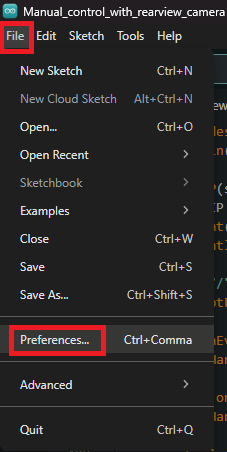
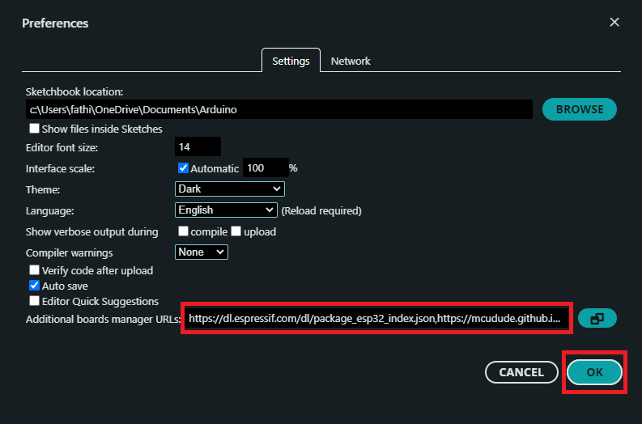
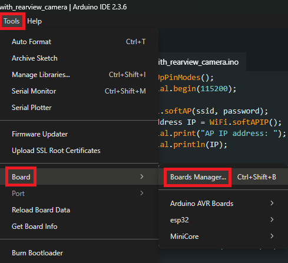
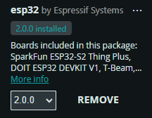
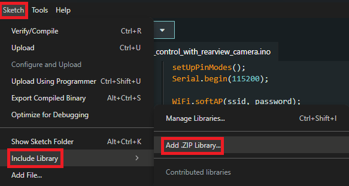
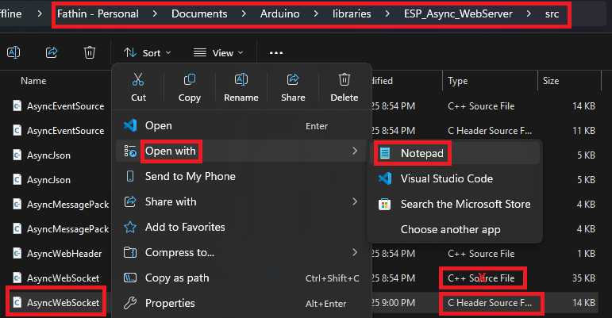
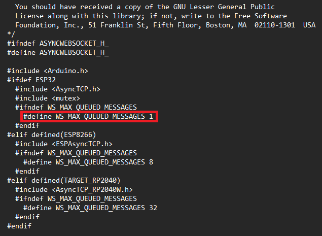
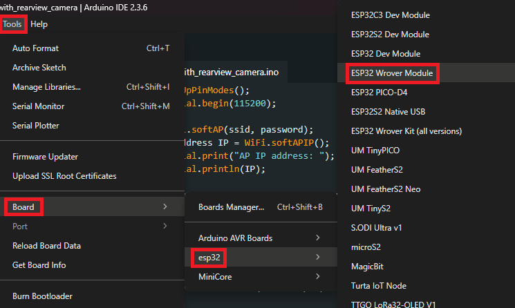
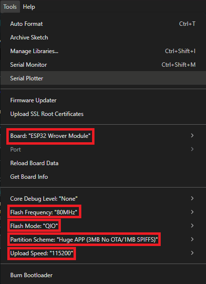

# Objective
Developed a cost-efficient Tesla-inspired robotic car using Arduino Uno and ESP32-CAM, featuring RFID-based door security lock, Wi-Fi–secured web server for manual control, and Bluetooth-based voice control via an android app, with the ability to switch seamlessly between manual and voice control modes at any time. Integrated an emergency braking and collision avoidance system using ultrasonic sensors that detect obstacles within 30 cm (front/rear) and 15 cm (during turns), automatically stopping the vehicle until a new command is received. Added a rearview camera with backlight support to enhance parking precision and low-light visibility.

---

# Full Setup & Installation Guidelines (Step by Step)
### <b>Step i: Installing ESP32 Board</b>  
1. Open Arduino IDE.
2. Go to: File > Preferences   
3. Paste this link https://dl.espressif.com/dl/package_esp32_index.json within the "Additional board manager URLs" section > Click "OK".     <b> NOTE: </b> If other boards are already installed, add a comma (,) at the end of the existing link/s, paste the link with no space, and then click ‘OK’ as shown in the above picture.
4. Go to: Tools > Board > Boards Manager.   
5. Search: "esp32 by Espressif Systems" > Select Version: 2.0.0 > Install.   

### <b>Step ii: Installing Necessary Libraries</b>  
1. Download: "AsyncTCP-master.zip" from [HERE](https://github.com/Fathin-Ishrak-Romeo/WiFi-Controlled-Surveillance-Robot-with-Pan-Tilt-Camera-Control-using-ESP32-Cam-Module/blob/main/Libraries/AsyncTCP-master.zip)
2. Download: "ESPAsyncWebServer-master.zip" from [HERE](https://github.com/Fathin-Ishrak-Romeo/WiFi-Controlled-Surveillance-Robot-with-Pan-Tilt-Camera-Control-using-ESP32-Cam-Module/blob/main/Libraries/ESPAsyncWebServer-master.zip)
3. Open Arduino IDE.
4. Go to: Sketch > Include Library > Add .ZIP Library.   
5. Select both of the downloaded "AsyncTCP-master.zip" and "ESPAsyncWebServer-master.zip" library files one by one > Click: "Open".

### <b>Step iii: Important Settings for Smooth Real-time Video Steaming</b>  
1. Open: "This PC".
2. Go to: "Documents" folder > "Arduino" folder > "librares" folder > "ESP_Async_WebServer" folder > "src" folder.
3. Right Click: "AsyncWebSocket.h" file > Open with > Notepad.   
4. Set the marked macro to 1 as shown in the below picture, then save the file by pressing "Win + S".   

### <b>Step iv: Using Arduino UNO as an External Programmer to Upload the Code into ESP32 CAM</b>  
1. Build the below circuit.  
2. Connect the Arduino UNO to the PC using USB cable.
3. Open Arduino IDE
4. Copy [WiFi-Controlled-Surveillance-Robot-WITHOUT-Pan-Tilt-Camera-Control.ino](https://github.com/Fathin-Ishrak-Romeo/WiFi-Controlled-Surveillance-Robot-with-Pan-Tilt-Camera-Control-using-ESP32-Cam-Module/blob/main/WiFi-Controlled-Surveillance-Robot-WITHOUT-Pan-Tilt-Camera%20Control.ino) OR [WiFi-Controlled-Surveillance-Robot-WITH-Pan-Tilt-Camera-Control.ino](https://github.com/Fathin-Ishrak-Romeo/WiFi-Controlled-Surveillance-Robot-with-Pan-Tilt-Camera-Control-using-ESP32-Cam-Module/blob/main/WiFi-Controlled-Surveillance-Robot-WITH-Pan-Tilt-Camera-Control.ino) code and paste it into the Arduino IDE.
5. Go to: Tools > Board > esp32 > ESP32 Wrover Module.   
6. Go to: Tools > Adjust the marked settings as below.   
7. Go to: Tools > Port > Select the port to which the Arduino is connected (If multiple ports are shown, try connecting one by one to find the actual port).
8. Upload the code.

<b>NOTE:</b> If the upload failed, that means there is a connection loss in the circuit.

----
# Circuit Diagram
### With Pan-Tilt Camera Control

----

<b> WiFi Name: </b> Surveillance Car  
<b> Password: </b> 12345678  
<b> Web Server: </b> 192.168.4.1
